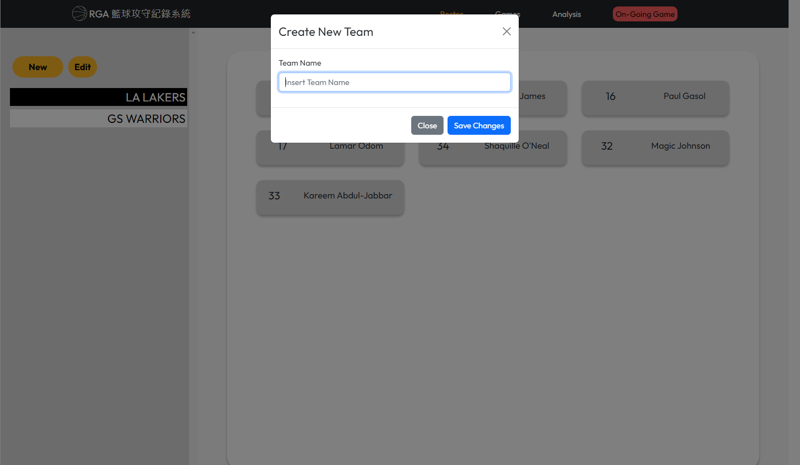
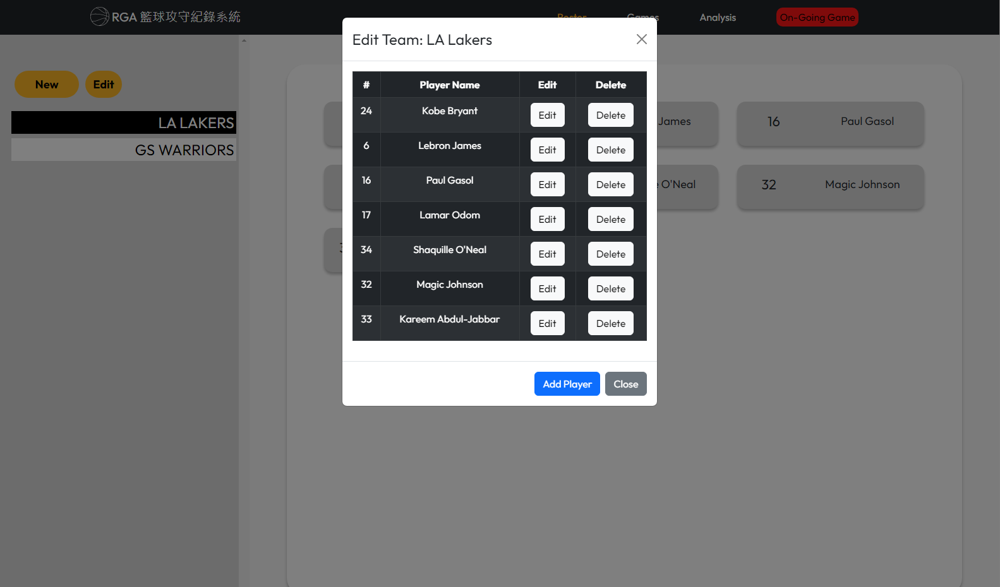
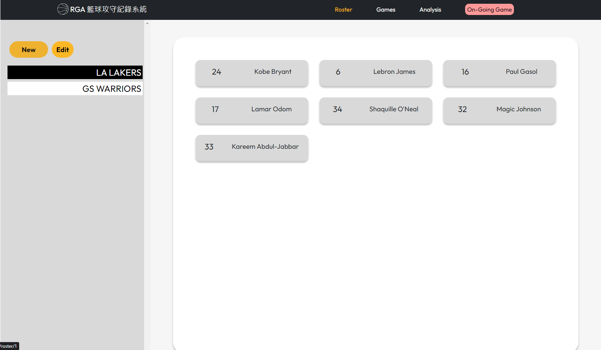
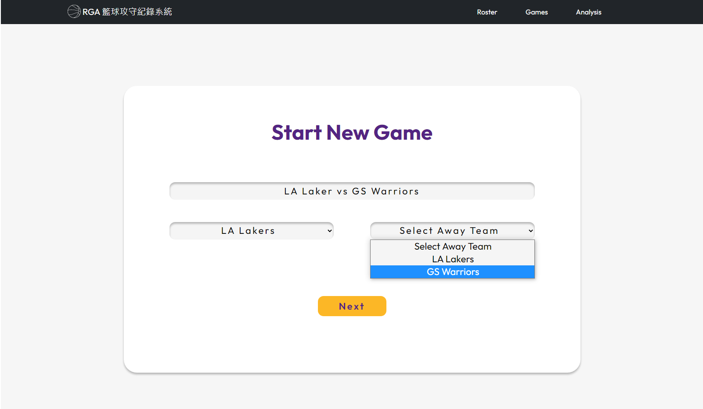
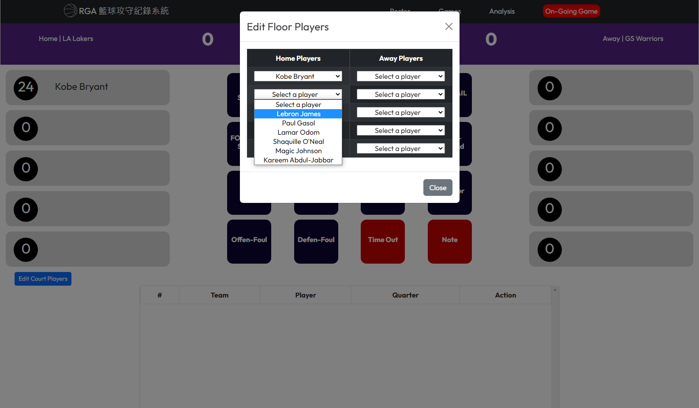
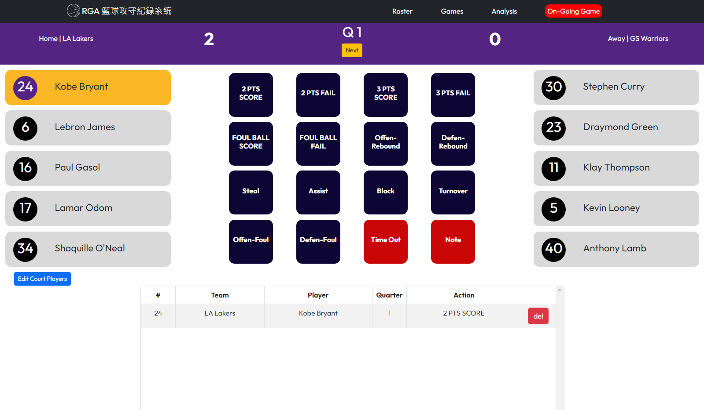
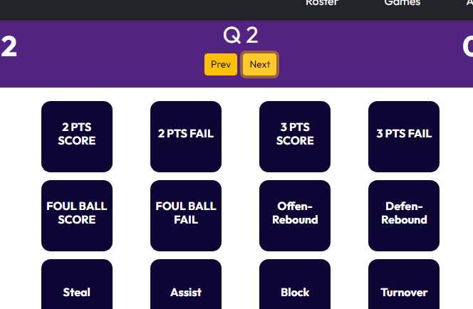
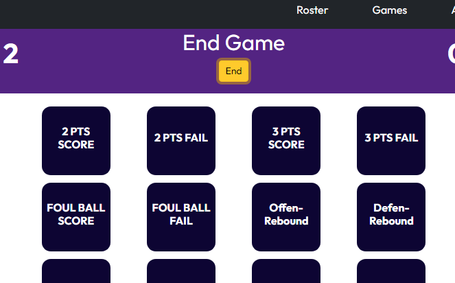
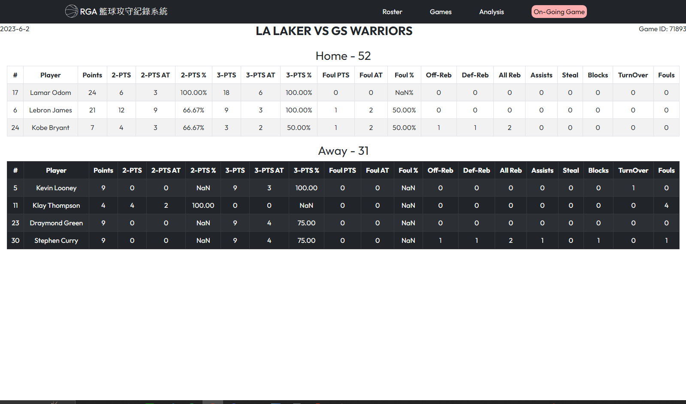

# RGA - Record Game Analysis

RGA is a basketball player stats recording tool that's built entirely on the web. I was initially inspired by my friend who helps with weekend basketball league in Taiwan and found out they do all their stats recording on paper, and it's 2023. So I thought, let's change that.

### Built with
- React
- React-Bootstrap
- Redux

### Getting Started

- npm
```
npm install
```
### Usage

### Developer Logs
**version 1.1**
*Major changes*
- added Game section for viewing past games
- added Login section 

*Minor Changes*
- added delete button for rosters
- fixed fetch data bugs in rosters


#### Getting Started - Adding team to the Roster

Navigate to *Roster* on the navbar at the top. User will be able to click the *New* button on the left column to add new team. 


After adding team name, click on it to then click the *edit* button to edit team roster. 
By default there are no members added in new team, click the *add team* button at the bottom and input player name and number.
If user need to edit player name/number, user may click the *edit* button next to player name.
If user need to remove a player from the roster, simply click on the *delete* button.


User can view team rosters by clicking on team name on the left.

#### Starting a game

Once user has added their team to the system, head back to home page.
Input the title for the game.
Choose home and away team.
Click *next* to start.


This page is where user can do all the live-recording during the game. First, input all the starting line-up players. To do so, click the *Edit Floor Player* button toward the bottom-left side of the page. 
User can swap-out players at any time.


To log player stats during the game:
1. Click on the player name. Player card color will change to yellow when selected.
2. While the player is selected, clicking on one of the 14 dark navy blue buttons in the center will log the stats accordingly to the player currently selected.

Stats log are displayed in at the bottom section in the order: Newest(top) to Oldest(bottom).
User can remove a stat log by clicking on the *del* button at the right of each log. 


As the game progress, user can click on *next* at the top to let the system know which quarter the game is currently at. When logging player stats into system, it will also log the corresponding quarter. 
If user makes a mistake by clicking *next* too many times, there is also a *prev* button for going back to the previous quarter. 


Clicking *next* at Q4 will take user to *End* button where user can click to navigate to **post-game stats section**.

#### Post Game Stats

Post Game Stats section will display all the recorded stats of players that have participated in the game.
The stats page is organized by Home and Away team. 
Date of game is shown at the top left.
Game ID is a unique ID generated for each game, shown at the top right.

#### Authentication
only Admin has permission to make changes to roster and game stats.
To login, go to *Login* on the very right of the navbar. 
Account: Admin
Password: password

### Roadmap
- [x] Show post game stats at the end
- [x] Host backend server to keep all the data on MongoDB
- [x] Login function for host with added permissions
- [ ] Functional time-out/note button
- [x] Add Game section where users can view pasts game stats
- [ ] Add Analysis section
- [ ] Traditional-Chinese
- [ ] Log for swapping players during the game

### Bugs
- [x] delete button works in roster>edit team but page will go blank at first
- [x] when adding player in roster, sometimes the player list will not update on the spot
- [x] when adding NEW TEAM, roster list are not updated on the spot (added a trigger to "fetchAllteams" when showModal state is changed. RosterLayout: 40)
- [x] if there are only one team on roster, team will not load even when clicked on (added if teams.length > 0 so teams.map will not map if length is 0)
- [ ] There are no team name and team score in game stats section
- [ ] "On-going Game" in navbar should be off when the game has ended


